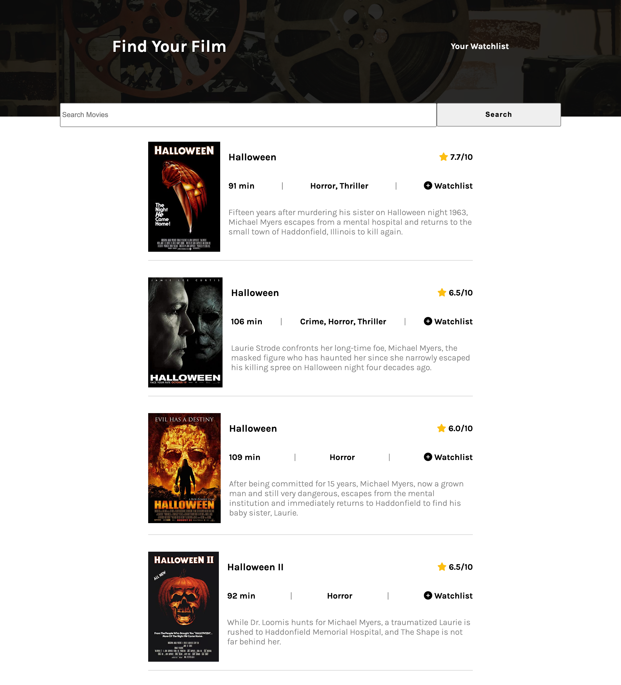
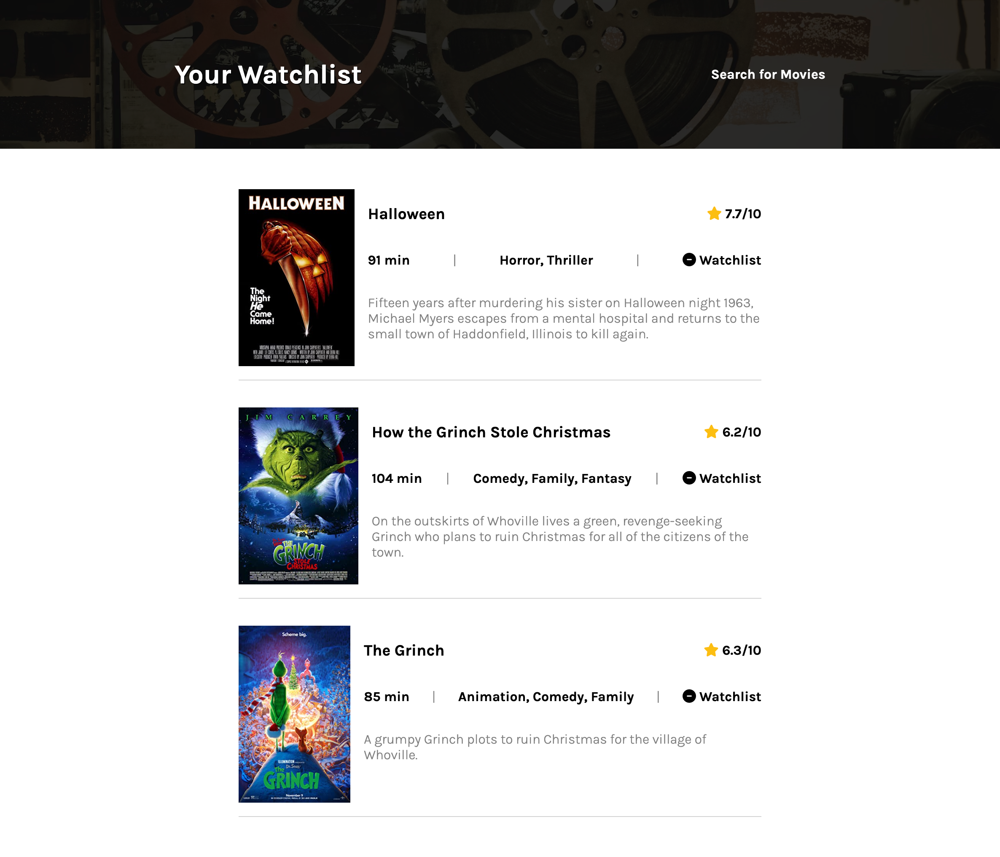

# movie-database

## Description
This project was made in HTML, CSS, and Javascript. It features the OMDB Api. When a user types in a search term, a list of movies including that term is added to the page. The user can see information about those movies. The user can also add the movies to a watchlist that uses localstorage. The watch list is hosted on a separate page.

## Usage
[Deployed Application](https://hope428.github.io/movie-database/)

## Credits

[OMDB Api](https://www.omdbapi.com/)
Scrimba 

